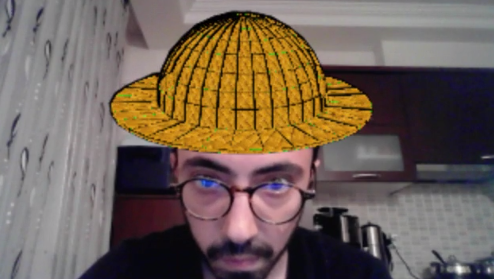

# 3D Snapchat Filter 
<!-- Improved compatibility of back to top link: See: https://github.com/othneildrew/Best-README-Template/pull/73 -->
<a name="readme-top"></a>
<!--
*** Thanks for checking out the Best-README-Template. If you have a suggestion
*** that would make this better, please fork the repo and create a pull request
*** or simply open an issue with the tag "enhancement".
*** Don't forget to give the project a star!
*** Thanks again! Now go create something AMAZING! :D
-->

<!-- ABOUT THE PROJECT -->
## About The Project

Snapchat filter using only Mediapipe and Opencv. You can see the sample image below. To use another object as the fiter, you need to modify coordinates of the object with a 3D modeling tool like Blender.



<!-- GETTING STARTED -->
## Getting Started

Instructions on setting up your project locally.
To get a local copy up and running follow these simple example steps.

### Prerequisites

Things you need to use the software and how to install them.
* Start by updating the package list using the following command
  ```sh
  sudo apt update
  ```

* Use the following command to install pip for Python 3
  ```sh
  sudo apt install python3-pip
  ```

* Once the installation is complete, verify the installation by checking the pip version
  ```sh
  pip --version
  ```

* Install the necessary packages to run the project
  ```sh
  pip install -r requirements.txt
  ```

### Running

1. Run main.py
   ```sh
   python main.py
   ```

